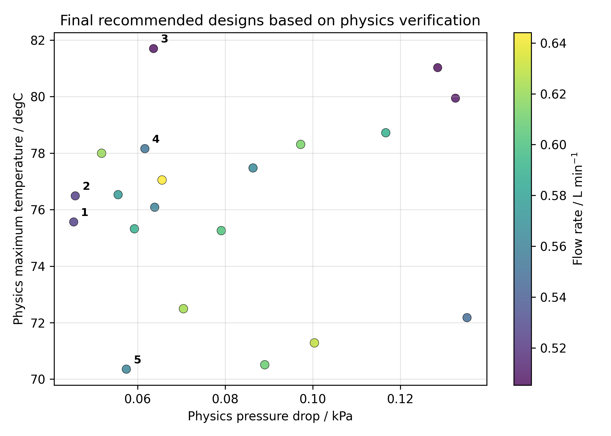

# AI-Liquid-Cooling-Designer

An engineering-oriented workflow for rapid liquid cold-plate screening before CFD.

## Project Overview

本项目面向 AI 芯片与功率器件的液冷冷板早期热设计，将 **physics-based model**、**design space search**、**surrogate model**、**AI recommender** 与 **physics verification** 串联成完整流程。

项目根据芯片热负荷、冷却液条件和冷板几何参数，快速估算最高温度、压降、泵功与流动状态；随后通过设计空间搜索和机器学习代理模型提高筛选效率，最终使用物理模型复核 AI 推荐结果。

> AI is used for fast screening. Final recommendations are ranked after physics verification.

## Why This Project?

传统 CFD 能提供详细的温度场、压力场和流量分布，但三维建模、网格划分、求解与迭代优化通常耗时较长。在早期设计阶段，工程师往往需要先回答：

- 哪些通道尺寸与流量组合可能满足温度和压降约束？
- 热性能改善是否值得额外的泵功和制造成本？
- 哪些候选方案值得进入 Fluent 或 COMSOL 精细验证？

本项目定位为 **pre-CFD rapid design screening tool**，用于快速缩小设计空间，而不是替代 CFD 或实验。

## Workflow

```text
Input design conditions
        ↓
Physics-based calculation
        ↓
Sensitivity analysis
        ↓
Design space search
        ↓
Surrogate model training
        ↓
AI recommendation
        ↓
Physics verification
        ↓
Report generation
```

## Features

- YAML case input
- Thermal-hydraulic calculation
- Sensitivity analysis
- Multi-parameter design space search
- Pareto front identification
- Surrogate model training and evaluation
- Engineering-oriented AI recommender
- AI pre-screening plus physics verification
- Streamlit visualization app
- Automatic Markdown/HTML design report

## Example Results

Current results generated from `examples/single_chip_case.yaml`:

| Result | Value |
| --- | --- |
| Temperature surrogate model | R2 = 0.9709, MAE = 3.83 °C |
| Pressure-drop surrogate model | R2 = 0.9230, MAE = 2.86 kPa |
| V1 mean recommended flow rate | 4.6668 L/min |
| V2 mean recommended flow rate | 0.5726 L/min |

V1 mainly optimizes temperature and pressure score, which can favor overcooling and excessive flow. V2 introduces overcooling, flow-rate and manufacturing-difficulty penalties, producing recommendations closer to low-system-cost engineering designs.

**Best recommended design after physics verification**

| Parameter | Value |
| --- | --- |
| `flow_rate_L_min` | 0.5072 L/min |
| `channel_number` | 22 |
| `channel_width_mm` | 1.1141 mm |
| `channel_height_mm` | 2.9424 mm |
| `physics_Tmax` | 81.7007 °C |
| `physics_pressure_drop` | 0.0636 kPa |




Detailed output is available in [the generated design report](reports/liquid_cooling_design_report.md).

## Quick Start

Python 3.9+ is recommended. Run commands from the project root:

```bash
pip install -r requirements.txt

python main.py
python src/sensitivity_analysis.py
python src/design_space_search.py
python src/surrogate_model.py
python src/design_recommender.py
python src/report_generator.py

streamlit run app_streamlit.py
```

Run the complete generation pipeline:

```bash
python scripts/run_all.py
```

## Project Structure

```text
AI-Liquid-Cooling-Designer/
├── main.py                         # Physics-based thermal-hydraulic model
├── app_streamlit.py                # Interactive visualization interface
├── requirements.txt
├── examples/
│   └── single_chip_case.yaml       # Baseline design input
├── src/
│   ├── sensitivity_analysis.py
│   ├── design_space_search.py
│   ├── surrogate_model.py
│   ├── design_recommender.py
│   └── report_generator.py
├── scripts/
│   └── run_all.py                  # End-to-end pipeline runner
├── data/                           # Generated CSV results
├── figures/                        # Generated plots
├── models/                         # Trained surrogate models
├── reports/                        # Generated design reports
└── docs/
    ├── interview_explanation.md
    ├── technical_questions.md
    └── project_log.md
```

## Model Assumptions and Limitations

- Simplified thermal resistance model
- No manifold flow distribution
- No contact thermal resistance
- No non-uniform heat source
- No temperature-dependent fluid properties
- CFD and experimental validation are still needed

这些简化假设使模型适合早期快速筛选，但不能替代详细三维流热耦合分析。

## Roadmap

- CFD validation with Fluent or COMSOL
- PyFluent automation template
- COMSOL LiveLink template
- Non-uniform heat source map
- Manifold flow distribution model
- Improved pressure-drop surrogate model with physics-informed features

